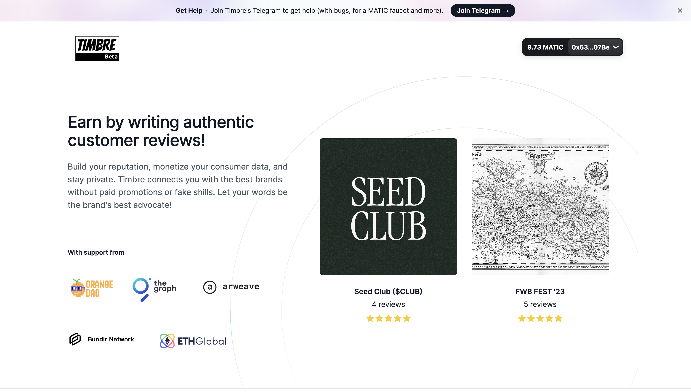
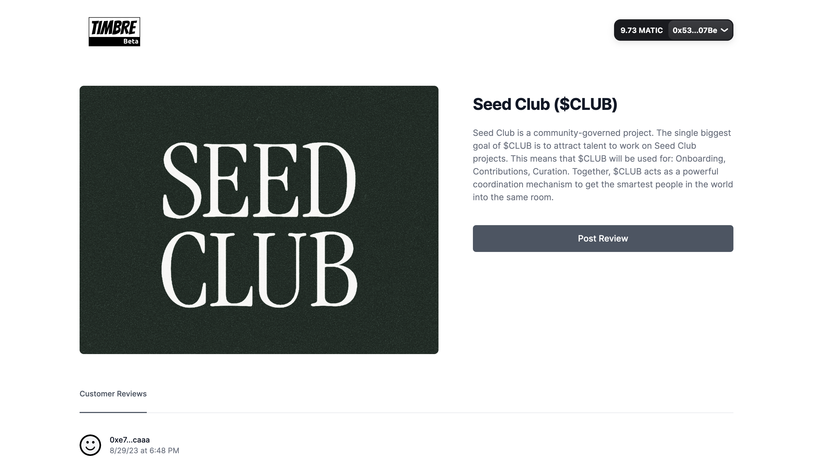
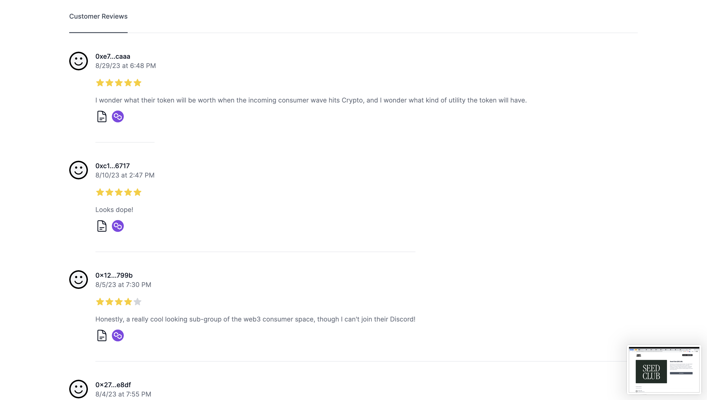

# Timbre Network

A privacy-preserving consumer data platform.

Visit [Timbre Network](https://www.beta-timbre.network/) by clicking here.

<pre></pre>

<pre></pre>

## What is this repository?

This repository contains the front-end Next.js and React code which allows you to connect to the website with your wallet. You can then read existing reviews and post new reviews using your wallet (e.g. MetaMask wallet).

## Usage

Our product is currently in Beta and if you'd like access or have any questions or suggestions please contact me on Twitter (https://twitter.com/arshaan_b).

## Support

We're lucky to be working closely with the following organizations: OrangeDAO, Arweave, TheGraph, Polygon, Bundlr, and ETHGlobal.
